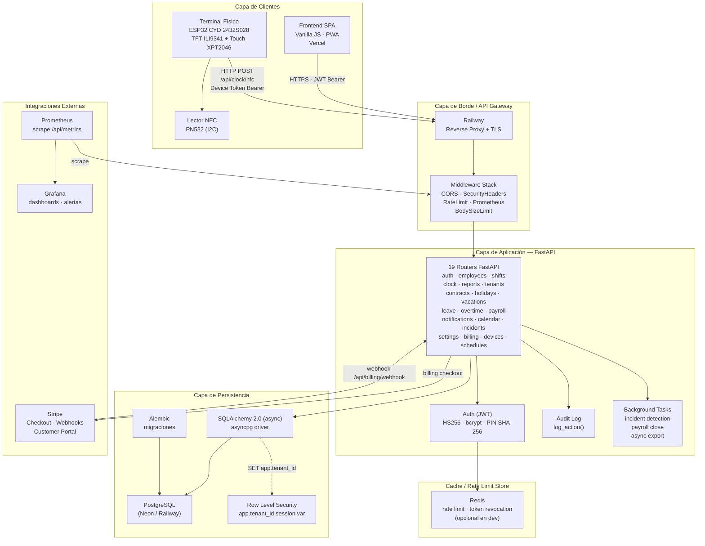
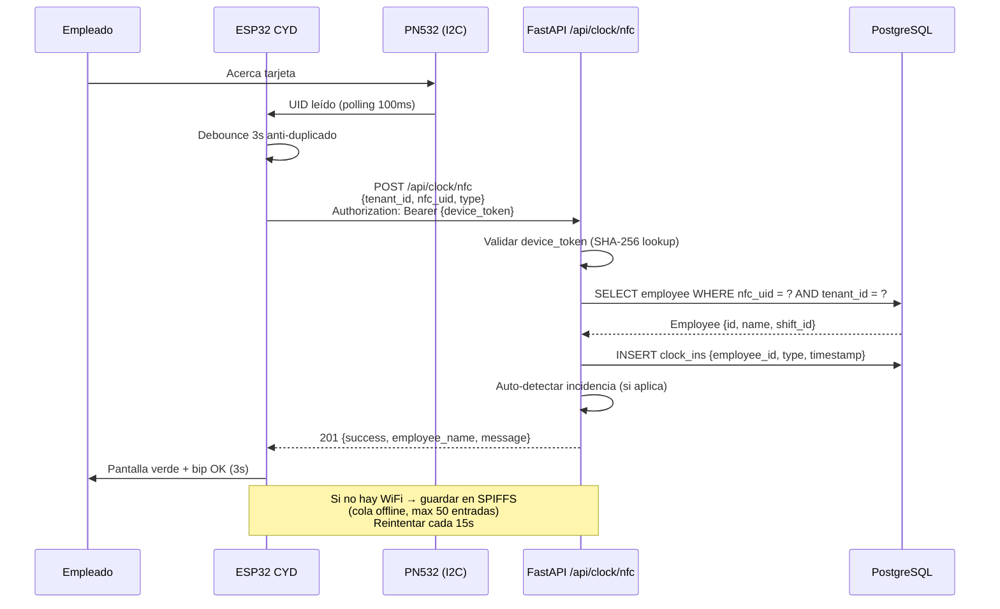
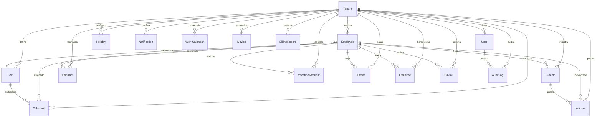

# TalentUP Fichaje — Documento de Arquitectura Técnica

**Versión:** 1.0  
**Fecha:** Agosto 2026  
**Repositorio:** `github.com/jordialbarracin/talentup-fichaje`  
**Stack:** FastAPI + SQLAlchemy + PostgreSQL + Vanilla JS SPA + ESP32 CYD + PN532 NFC  
**Cumplimiento:** RD-ley 8/2019 (art. 34.9 ET) — Registro de jornada laboral en hostelería

---

## Tabla de contenidos

1. [Visión general del sistema](#1-visión-general-del-sistema)
2. [Diagrama de arquitectura](#2-diagrama-de-arquitectura)
3. [Descripción de capas](#3-descripción-de-capas)
4. [Patrones de diseño](#4-patrones-de-diseño)
5. [Multi-tenancy y aislamiento](#5-multi-tenancy-y-aislamiento)
6. [Modelo de datos principal](#6-modelo-de-datos-principal)
7. [Autenticación y autorización (JWT)](#7-autenticación-y-autorización-jwt)
8. [Integraciones externas](#8-integraciones-externas)
9. [Observabilidad y monitoring](#9-observabilidad-y-monitoring)
10. [Seguridad y cumplimiento legal](#10-seguridad-y-cumplimiento-legal)
11. [Deployment e infraestructura](#11-deployment-e-infraestructura)
12. [Decisiones de diseño (ADRs)](#12-decisiones-de-diseño-adrs)

---

## 1. Visión general del sistema

TalentUP Fichaje es un SaaS multi-tenant de fichaje digital para el sector de hostelería en España. El sistema da cumplimiento al **Real Decreto-ley 8/2019**, que obliga a llevar un registro de jornada de los trabajadores (entrada, salida, pausas) con conservación mínima de 4 años, registro inmutable y exportación para inspección laboral.

El producto tiene tres frentes de interacción:

| Frente | Descripción | Tecnología |
|--------|-------------|------------|
| **Dashboard web** | Panel de gestión para owners y managers (empleados, turnos, horarios, informes, configuración) | SPA vanilla JS (PWA) desplegada en Vercel |
| **Terminal físico** | Tablet/terminal en modo kiosk donde los empleados fichan con PIN o tarjeta NFC | ESP32 CYD 2432S028 + lector NFC PN532 (I2C) |
| **Backend API** | API REST que sirve a ambos frentes con aislamiento por tenant | FastAPI + SQLAlchemy (async) + PostgreSQL |

El modelo de negocio es **pago por establecimiento** (no por empleado): un pago único de ~245 € por el terminal físico y una suscripción de 29–39 €/mes por restaurante, facturado vía Stripe.

### Roles de usuario

| Rol | Ámbito | Permisos |
|-----|--------|----------|
| `super_admin` | Global (Grupo RAS) | Gestiona todos los tenants, crea restaurantes, ve informes agregados |
| `owner` | Un tenant | Gestiona su restaurante: empleados, turnos, horarios, configuración, billing |
| `manager` | Un tenant | Ficha, ve informes de su turno, operaciones diarias |
| `employee` | No tiene login API | Solo ficha desde el terminal (PIN o NFC) |

> **Nota:** Los empleados **no** son `User` en la API. Son registros de `Employee` con `pin_hash` y `nfc_card_id`. El terminal valida el PIN contra `Employee.pin_hash` (bcrypt + SHA-256 indexado).

---

## 2. Diagrama de arquitectura

### 2.1 Diagrama de sistema (Mermaid)



### 2.2 Diagrama de flujo de fichaje NFC (Mermaid sequence)



### 2.3 Diagrama de capas (texto)

```
┌─────────────────────────────────────────────────────────┐
│  PRESENTATION LAYER                                     │
│  ├─ SPA Vanilla JS (index.html + app.js + i18n.js)     │
│  ├─ PWA (manifest.json + service worker)                │
│  └─ ESP32 CYD firmware (TFT_eSPI + PN532)               │
├─────────────────────────────────────────────────────────┤
│  API GATEWAY / EDGE                                     │
│  ├─ Railway reverse proxy (TLS termination)             │
│  ├─ CORS Middleware                                     │
│  ├─ SecurityHeadersMiddleware (CSP nonce, HSTS, XFO)   │
│  ├─ RateLimitMiddleware (sliding window per IP/path)    │
│  ├─ PrometheusMetricsMiddleware (counters/histograms)  │
│  └─ BodySizeLimitMiddleware (1 MB max)                  │
├─────────────────────────────────────────────────────────┤
│  API LAYER — FastAPI Routers (19 routers)               │
│  ├─ auth        POST /api/auth/login, register, refresh│
│  ├─ employees   CRUD /api/employees                     │
│  ├─ shifts      CRUD /api/shifts                         │
│  ├─ schedules   CRUD /api/schedules                      │
│  ├─ clock       POST /api/clock, /nfc, /qr, /history    │
│  ├─ reports     GET /api/reports/hours, export, etc.    │
│  ├─ tenants     CRUD /api/tenants (super_admin)         │
│  ├─ contracts   CRUD /api/contracts                      │
│  ├─ holidays    CRUD /api/holidays                       │
│  ├─ vacations   GET/POST /api/vacations + approve/reject│
│  ├─ leave       CRUD /api/leave (bajas IT)              │
│  ├─ overtime    GET/POST /api/overtime + /calculate     │
│  ├─ payroll     GET /api/payroll, POST /close           │
│  ├─ notifications GET/POST /api/notifications            │
│  ├─ calendar    GET/POST /api/calendar + /generate      │
│  ├─ incidents   GET /api/incidents, PATCH /resolve     │
│  ├─ settings    GET/PUT /api/settings                    │
│  ├─ billing     POST /api/billing/checkout-session     │
│  └─ devices     POST /api/devices (registro terminal)   │
├─────────────────────────────────────────────────────────┤
│  DOMAIN LAYER (lógica de negocio)                        │
│  ├─ auth.py — JWT encode/decode, bcrypt verify, PIN hash│
│  ├─ audit.py — log_action() registro inmutable          │
│  ├─ tasks.py — incident detection, payroll close        │
│  ├─ pagination.py — offset/limit envelope estandarizado │
│  ├─ rate_limiter.py — Redis-backed rate limit helpers   │
│  └─ rls.py — RLS policy helpers (Alembic)               │
├─────────────────────────────────────────────────────────┤
│  PERSISTENCE LAYER                                       │
│  ├─ SQLAlchemy 2.0 (async) — DeclarativeBase             │
│  ├─ 23 modelos (Tenant, User, Employee, Shift, ...)     │
│  ├─ asyncpg driver (PostgreSQL) / aiosqlite (dev)       │
│  ├─ Alembic migrations (RLS, JSONB, composite indexes)  │
│  └─ PostgreSQL (Neon/Railway) + Redis (opcional)         │
└─────────────────────────────────────────────────────────┘
```

---

## 3. Descripción de capas

### 3.1 Presentation Layer (Capa de Presentación)

#### Frontend SPA

El dashboard de gestión es una **SPA vanilla JS** sin framework de build. Está compuesta por:

- **`index.html`** (~77 KB): estructura del dashboard con todas las vistas inline (login, empleados, turnos, horarios, fichajes, informes, configuración).
- **`app.js`**: lógica de navegación, fetch a la API, manejo de JWT en cookies httpOnly, renderizado de tablas y formularios.
- **`i18n.js`** (~63 KB): traducciones ES/CA/EN cargadas dinámicamente.
- **PWA**: `manifest.json` + service worker para offline-first en el terminal tablet.
- **`landing.html`**: landing page pública con SEO, JSON-LD y pricing.

> **Roadmap v1.0:** El frontend está en producción pero el dashboard aún necesita estilización (`dashboard_structure.html` tiene 915 líneas sin `<style>`) y conexión real a la API. Hay un design system v2 en preparación (`design_system.css`).

#### Terminal físico ESP32 CYD

El terminal es un **ESP32-WROOM-32** montado en la placa **CYD 2432S028** (Cheap Yellow Display):

- **Display:** TFT ILI9341 240×320 px con driver **TFT_eSPI**.
- **Touch:** XPT2046 (resistivo) — no usado en el flujo principal de fichaje.
- **NFC:** Lector **PN532** conectado por **I2C** (SDA=IO22, SCL=IO27).
- **Conectividad:** WiFi integrado del ESP32.
- **Almacenamiento:** SPIFFS para cola offline (máx. 50 fichajes encolados).
- **OTA:** ArduinoOTA para actualizaciones de firmware inalámbricas.
- **Watchdog:** esp_task_wdt con timeout de 30s.

El firmware (~25 KB, 911 líneas) se compila con PlatformIO (`platformio.ini`). Las credenciales WiFi, la URL del backend y el `tenant_id` se inyectan vía `build_flags`.

**Flujo del terminal:**

1. Boot: init I2C → init PN532 → conectar WiFi → init OTA.
2. Bucle principal: polling NFC cada 100ms → debounce 3s → POST `/api/clock/nfc`.
3. Si no hay WiFi: guardar en SPIFFS (`/fichajes_queue.json`) → reintentar cada 15s.
4. Feedback visual: pantalla verde + bip OK (3s) o pantalla roja + bip error.
5. OTA: procesa updates en background en cada iteración del loop.

### 3.2 API Gateway / Edge Layer

Railway actúa como reverse proxy con terminación TLS. Por encima de la aplicación FastAPI, se ejecuta una pila de middlewares en orden:

| Middleware | Función |
|------------|---------|
| `SecurityHeadersMiddleware` | CSP con nonce por-request, `X-Content-Type-Options: nosniff`, `X-Frame-Options: DENY`, HSTS en HTTPS |
| `PrometheusMetricsMiddleware` | Contadores e histogramas de peticiones HTTP (duración, total, estado) |
| `BodySizeLimitMiddleware` | Limita el body a 1 MB (previene payloads maliciosos) |
| `RateLimitMiddleware` | Sliding window per (IP, path). Límites: login 10/min, clock 30/min, employees 60/min, default 100/min |
| `CORSMiddleware` | Permite orígenes configurados (Vercel frontend) |

> En producción, `docs_url`, `redoc_url` y `openapi_url` se desactivan (`None`) para no exponer el esquema de la API.

### 3.3 API Layer — FastAPI Routers

La aplicación FastAPI registra **19 routers** mediante `app.include_router()`. Cada router:

- Tiene un **prefijo** (`/api/employees`, `/api/shifts`, etc.) y **tags** OpenAPI.
- Define **esquemas Pydantic** (`*Create`, `*Update`) para validación de request body.
- Usa **dependencias de autorización** (`Depends(get_current_user)`, `Depends(require_owner)`, etc.).
- Aplica **paginación** estandarizada vía `paginate()` helper (`page`, `limit`, `total`, `pages`).
- Registra **auditoría** con `log_action()` para operaciones de escritura.

**Router WebSocket:** El router `clock` incluye un `ws_router` para comunicación en tiempo real (estados del terminal, notificaciones push al dashboard).

#### Inyección de tenant_id

Cada request autenticada extrae el `tenant_id` del JWT (`payload["tenant_id"]`). Las queries SQLAlchemy filtran siempre por `tenant_id`:

```python
query = select(Employee).where(Employee.tenant_id == current_user.tenant_id)
```

El `super_admin` tiene una excepción: puede pasar `tenant_id` como query param opcional o ver todos los tenants (sin filtro).

### 3.4 Domain Layer (Lógica de dominio)

El dominio está distribuido en módulos de servicio (no hay una capa de servicios formal con interfaces — patrón "thin service layer"):

| Módulo | Responsabilidad |
|--------|-----------------|
| `app/auth.py` | Hash bcrypt, verificación, JWT encode/decode, PIN hash SHA-256, dependencias de rol |
| `app/audit.py` | `log_action()` — escribe en `audit_log` (registro inmutable de cambios) |
| `app/tasks.py` | Background tasks: detección de incidencias, cierre de nómina |
| `app/pagination.py` | Helper `paginate()` — offset/limit con envoltura estandarizada |
| `app/rate_limiter.py` | Helpers de rate limit Redis-backed con fallback in-memory |
| `app/rls.py` | Helpers para Alembic: `enable_rls()`, `create_tenant_policy()` |
| `app/metrics.py` | Definiciones Prometheus: `HTTP_REQUESTS_TOTAL`, `HTTP_REQUEST_DURATION_SECONDS`, `ACTIVE_CONNECTIONS` |
| `app/openapi_docs.py` | Metadatos OpenAPI, esquemas de respuesta reutilizables |

### 3.5 Persistence Layer (Capa de Persistencia)

#### SQLAlchemy 2.0 (async)

- **Engine:** `create_async_engine` con driver `asyncpg` (PostgreSQL) o `aiosqlite` (dev).
- **Pool:** `pool_size=20`, `max_overflow=40`, `pool_timeout=30`, `pool_recycle=1800` (solo PostgreSQL).
- **Session:** `async_sessionmaker` con `AsyncSession`.
- **Base:** `DeclarativeBase` — todos los modelos heredan de ella.
- **IDs:** UUID v4 como `String(36)` para compatibilidad SQLite (en PostgreSQL se podría migrar a `UUID` nativo).

#### ContextVar para tenant_id

```python
tenant_id_ctx: ContextVar[str | None] = ContextVar("tenant_id_ctx", default=None)
```

Este `ContextVar` permite que `get_db` configure la sesión PostgreSQL con `SET app.tenant_id = ?` para que RLS filtre automáticamente las filas.

#### Alembic (Migraciones)

- **`9b16fa110308_initial.py`** — Esquema inicial.
- **`a15b29a48457_enable_rls_tenant_isolation.py`** — Activa RLS y crea policies de tenant en todas las tablas con `tenant_id`.
- **`1a2b3c4d5e6f_add_composite_indexes.py`** — Índices compuestos para queries frecuentes (tenant_id + is_active, tenant_id + timestamp, etc.).
- **`4af19aaef1cc_merge_heads.py`** — Merge de heads.

> **Roadmap:** Migrar `audit_log` de `sa.JSON()` a `JSONB` para indexar en PostgreSQL.

---

## 4. Patrones de diseño

### 4.1 Repository Pattern (implícito)

Los modelos SQLAlchemy actúan como repositorios: cada modelo expone un método `to_dict()` / `to_dict_full()` que serializa la entidad. Las queries se construyen inline en los routers con `select()`. No hay una capa de repositorios separada con interfaces — el patrón está **implícito** en los modelos.

```python
# Patrón implícito: el modelo es el repositorio
result = await db.execute(
    select(Employee).where(Employee.tenant_id == tenant_id, Employee.is_active == True)
)
employees = result.scalars().all()
data = [e.to_dict() for e in employees]  # to_dict() = serialización con XSS escaping + PII masking
```

### 4.2 Service Layer Pattern (thin)

La lógica de negocio vive en los routers y en módulos de dominio (`auth.py`, `audit.py`, `tasks.py`). No hay servicios formales con interfaces. Las operaciones complejas (detección de incidencias, cálculo de nómina) se delegan a **background tasks**.

### 4.3 Dependency Injection (FastAPI)

Las dependencias se inyectan vía `Depends()`:

```python
@router.post("", status_code=201)
async def create_employee(
    data: EmployeeCreate,
    current_user: User = Depends(require_owner),  # autorización
    db: AsyncSession = Depends(get_db),            # sesión BD
):
    ...
```

### 4.4 Middleware Chain Pattern

La pila de middlewares se ejecuta en orden inverso al de registro (último registrado = primero en ejecutarse). Esto permite que `SecurityHeadersMiddleware` añada headers a la response final.

### 4.5 DTO Pattern (Pydantic)

Cada router define esquemas `*Create` y `*Update` con validación:

```python
class ShiftCreate(BaseModel):
    name: str
    start_time: str  # HH:MM — validado con regex ^([01]\d|2[0-3]):([0-5]\d)$
    end_time: str
    is_night: bool = False
    plus_nocturnidad: float = 0
    ...
```

### 4.6 Serialization with XSS/PII Protection

Todos los modelos implementan `to_dict()` con:

- **XSS escaping:** `html.escape()` en todos los campos de texto (`_s()` helper).
- **PII masking:** DNI, NIE, número SS, IBAN, teléfono, email se enmascaran en respuestas normales (`_mask()`). `to_dict_full()` expone los datos sin enmascarar (uso interno/admin).

### 4.7 Immutable Event Log (ClockIn)

Los fichajes (`ClockIn`) son **inmutables**: no se editan, solo se cancelan con motivo:

```python
is_cancelled = Column(Boolean, default=False)
cancel_reason = Column(Text, nullable=True)
cancelled_by = Column(String(36), ForeignKey("users.id"), nullable=True)
cancelled_at = Column(DateTime(timezone=True), nullable=True)
```

Esto cumple el requisito del RD-ley 8/2019 de registro inmutable.

---

## 5. Multi-tenancy y aislamiento

### 5.1 Estrategia: Shared Schema con `tenant_id` + RLS

TalentUP Fichaje usa el patrón **shared schema with `tenant_id` column** reforzado con **Row Level Security (RLS)** de PostgreSQL:

- Todas las tablas de negocio tienen una columna `tenant_id` (FK a `tenants.id`, `ON DELETE CASCADE`).
- PostgreSQL RLS se habilita en cada tabla con una policy que compara `tenant_id` con la variable de sesión `app.tenant_id`.
- La aplicación establece `SET app.tenant_id = ?` al inicio de cada sesión/transacción.
- El `super_admin` puede ver todos los tenants (no se aplica filtro RLS en su caso).

```sql
-- Política RLS (creada por Alembic migration)
ALTER TABLE employees ENABLE ROW LEVEL SECURITY;
CREATE POLICY tenant_isolation ON employees
    USING (tenant_id = current_setting('app.tenant_id')::text);
```

### 5.2 ContextVar para inyección de tenant

```python
# app/database.py
tenant_id_ctx: ContextVar[str | None] = ContextVar("tenant_id_ctx", default=None)

# En get_db(): si tenant_id_ctx está set, ejecutar SET app.tenant_id
```

### 5.3 Comparación de estrategias

| Estrategia | Ventajas | Desventajas | ¿Usada? |
|------------|----------|------------|---------|
| **Schema-per-tenant** | Aislamiento total, backup/restore por tenant | Coste de gestión de N schemas, migraciones por schema | No |
| **Shared schema + tenant_id** | Simple, escalable, una migración para todos | Riesgo de fuga si se olvidan filtros | **Sí** |
| **Database-per-tenant** | Aislamiento máximo | Coste elevado, complejidad operativa | No |

La elección de **shared schema + RLS** ofrece defensa en profundidad: incluso si un router olvida el filtro `WHERE tenant_id = ?`, RLS bloquea el acceso a filas de otros tenants a nivel de base de datos.

### 5.4 Indices compuestos

Para optimizar queries multi-tenant frecuentes, se crean índices compuestos:

```python
# Employee
Index("ix_employee_tenant_active", "tenant_id", "is_active")

# ClockIn
Index("ix_clock_tenant_emp_time", "tenant_id", "employee_id", "timestamp")
Index("ix_clock_tenant_time", "tenant_id", "timestamp")

# Incident
Index("ix_incident_tenant_type", "tenant_id", "incident_type")
Index("ix_incident_tenant_date", "tenant_id", "date")
Index("ix_incident_tenant_emp_date", "tenant_id", "employee_id", "date")

# Schedule
Index("ix_schedule_tenant_date", "tenant_id", "date")
UniqueConstraint("tenant_id", "employee_id", "date", name="uq_schedule_employee_date")
```

---

## 6. Modelo de datos principal

### 6.1 Visión general (ERD en Mermaid)



### 6.2 Modelo principal (23 modelos SQLAlchemy)

| Modelo | Tabla | Descripción |
|--------|-------|-------------|
| **Tenant** | `tenants` | Restaurante/establecimiento. Config de convenio, vacaciones, nómina, billing (Stripe). |
| **User** | `users` | Usuario con login API (super_admin, owner, manager). FK a tenant. |
| **Employee** | `employees` | Empleado sin login API. 34+ campos: datos personales, laborales, fichaje (PIN hash, NFC), vacaciones, saldos, económico, formación, estado. |
| **Shift** | `shifts` | Turno (mañana, tarde, noche, partido, rotativo). Horas, tolerancia, grace period, plus nocturnidad/festividad. |
| **Schedule** | `schedules` | Asignación empleado-turno-fecha. UniqueConstraint (tenant_id, employee_id, date). |
| **ClockIn** | `clock_ins` | Fichaje inmutable. Tipo (in/out/break_start/break_end), timestamp, geolocalización, offline, cancelación con motivo. |
| **Incident** | `incidents` | Incidencia (12 tipos: no fichó, fichó tarde, fichó fuera de turno, etc.). Auto-generada o manual. Resolución. |
| **AuditLog** | `audit_log` | Log inmutable de todos los cambios del sistema. |
| **Contract** | `contracts` | Contrato laboral: tipo, categoría, duración, salario, renovaciones. |
| **Holiday** | `holidays` | Festivo: nacional, regional, local. Pagado, laborable. |
| **VacationRequest** | `vacation_requests` | Solicitud de vacaciones/días propios. Aprobación/rechazo. |
| **Leave** | `leaves` | Baja IT (enfermedad, accidente laboral, enfermedad profesional). Partes médicos. |
| **Overtime** | `overtimes` | Horas extra: estructurales, compensadas, pagadas. Multiplicador. |
| **Payroll** | `payrolls` | Nómina mensual: bruto, IRPF, SS, neto. Cierre de nómina. |
| **Notification** | `notifications` | Notificación in-app/whatsapp/email. Leída/no leída. |
| **WorkCalendar** | `work_calendars` | Calendario laboral: tipo de día, horario, festivos. |
| **Device** | `devices` | Terminal físico: token (SHA-256), nombre, activo. |
| **Geofence** | `geofences` | Geocerca para validación de ubicación de fichaje. |
| **DocumentTemplate** | `document_templates` | Plantillas de documentos (contratos, nóminas, informes). |
| **BillingRecord** | `billing_records` | Registro de facturación Stripe. |

### 6.3 Detalle de modelos core

#### Tenant (`tenants`)

```
id              UUID PK
name            String(200) NOT NULL       — Nombre comercial
legal_name      String(200)                — Razón social
cif             String(20)                 — CIF
convenio        String(100) default "hosteleria"
ccaa            String(100)                — Comunidad autónoma
locality        String(100)                — Localidad (para convenio)
tolerancia_min  Integer default 5          — Tolerancia de fichaje (min)
auto_detect_incidents  Boolean default True
allow_offline_clock     Boolean default True
max_offline_hours      Integer default 24
vacation_days_per_year  Numeric(5,2) default 30
payroll_day      Integer default 30
payroll_period   String(20) default "monthly"
irpf_default     Numeric(5,2)
ss_employee_percent   Numeric(5,2) default 6.35
ss_company_percent    Numeric(5,2) default 29.90
plan             String(20) default "basic"  — basic, pro
subscription_status  String(20) default "active"
stripe_customer_id   String(100)
stripe_subscription_id String(100)
max_employees   Integer default 50
is_active        Boolean default True
setup_completed  Boolean default False
created_at / updated_at  DateTime(tz)
```

#### Employee (`employees`) — campos clave

```
id              UUID PK
tenant_id       UUID FK tenants.id ON DELETE CASCADE
employee_code   String(20)

# Datos personales
name            String(200) NOT NULL
dni / nie       String(20)
numero_ss       String(20)
birth_date      Date
phone / email   String

# Datos laborales
categoria_profesional  String(100)
tipo_contrato   String(50)
fecha_alta / fecha_baja  Date
tipo_jornada    String(50)
horas_semanales / horas_diarias  Numeric(5,2)
grupo_cotizacion  String(20)
base_cotizacion   Numeric(10,2)

# Datos de fichaje (SEGURIDAD)
pin_hash        String(200) NOT NULL        — bcrypt
pin_hash_fast   String(64) INDEXED          — SHA-256 (lookup rápido)
nfc_card_id     String(100)
nfc_uid         String(50)
shift_id        UUID FK shifts.id
clock_method    String(20) default "pin"    — pin, nfc, qr

# Vacaciones y saldos
vacation_annual_days  Numeric(5,2) default 30
saldo_vacaciones      Numeric(5,2) default 30
saldo_banco_horas     Numeric(10,2) default 0
horas_extra_pendientes Numeric(10,2) default 0

# Económico
coste_hora      Numeric(10,2)
iban            String(34)

# Estado
estado          String(20) default "activo"  — activo, baja, vacaciones, permiso
is_active       Boolean default True
```

#### ClockIn (`clock_ins`) — fichaje inmutable

```
id              UUID PK
tenant_id       UUID FK tenants.id ON DELETE CASCADE
employee_id     UUID FK employees.id ON DELETE CASCADE
type            String(20) NOT NULL  — in, out, break_start, break_end
timestamp       DateTime(tz) NOT NULL default now()
latitude        Float
longitude       Float
is_offline      Boolean default False
synced_at       DateTime(tz)
is_cancelled    Boolean default False
cancel_reason   Text
cancelled_by    UUID FK users.id
cancelled_at    DateTime(tz)

Indexes:
  ix_clock_tenant_emp_time (tenant_id, employee_id, timestamp)
  ix_clock_tenant_time (tenant_id, timestamp)
```

#### Incident (`incidents`)

```
id              UUID PK
tenant_id       UUID FK tenants.id ON DELETE CASCADE
employee_id     UUID FK employees.id ON DELETE CASCADE
date            Date NOT NULL
incident_type   String(50) NOT NULL
  — Tipos: no_clock_in, no_clock_out, late_arrival, early_leave,
           missed_break, clock_outside_shift, duplicate_clock,
           missing_break, overtime_unauthorized, schedule_mismatch,
           offline_clock, manual
description     Text
severity        String(20) default "warning"  — info, warning, critical

clock_in_id     UUID FK clock_ins.id
schedule_id     UUID FK schedules.id
shift_id        UUID FK shifts.id

is_resolved     Boolean default False
resolution      Text
resolved_by     UUID FK users.id
resolved_at     DateTime(tz)

source          String(20) default "auto"  — auto, manual, employee_report
reported_by     UUID FK users.id

Indexes:
  ix_incident_tenant_type (tenant_id, incident_type)
  ix_incident_tenant_date (tenant_id, date)
  ix_incident_tenant_emp_date (tenant_id, employee_id, date)
```

---

## 7. Autenticación y autorización (JWT)

### 7.1 Esquema de autenticación

| Aspecto | Valor |
|---------|-------|
| **Algoritmo JWT** | HS256 |
| **Secret** | `JWT_SECRET` (env, obligatorio en producción) |
| **Access token expiry** | 480 minutos (8 horas) — configurable vía `JWT_EXPIRE_MINUTES` |
| **Refresh token expiry** | 30 días — configurable vía `JWT_REFRESH_EXPIRE_DAYS` |
| **Password hashing** | bcrypt (passlib `CryptContext`) |
| **PIN hashing (empleado)** | bcrypt + SHA-256 indexado (`pin_hash_fast`) |
| **PIN salt** | `PIN_HASH_SALT` (env, obligatorio) |
| **Transporte del token** | Bearer header + httpOnly cookie (CSRF-safe) |

### 7.2 Claims del JWT

```json
{
  "sub": "user-uuid",
  "email": "owner@restaurante.com",
  "role": "owner",
  "tenant_id": "tenant-uuid",
  "type": "access",   // o "refresh"
  "exp": 1234567890
}
```

### 7.3 PIN de empleado (doble hash)

El PIN del empleado usa un esquema de doble hash para permitir lookup indexado sin exponer el PIN:

1. **`pin_hash`** (bcrypt): hash autoritativo para verificación. No se expone nunca en API.
2. **`pin_hash_fast`** (SHA-256 con salt): hash rápido indexado para buscar el empleado por PIN sin iterar toda la tabla.

```python
def compute_pin_hash_fast(pin: str) -> str:
    return hashlib.sha256((pin + _SECRET_SALT).encode("utf-8")).hexdigest()

# Flujo de fichaje por PIN:
# 1. Calcular pin_hash_fast del PIN introducido
# 2. SELECT employee WHERE pin_hash_fast = ? AND tenant_id = ?
# 3. verify_password(pin, employee.pin_hash) — verificación autoritativa con bcrypt
```

### 7.4 Dependencias de autorización

```python
# app/auth.py
get_current_user       — requiere JWT válido (cualquier rol autenticado)
require_manager         — super_admin, owner, manager
require_owner          — super_admin, owner
require_super_admin    — solo super_admin
require_device_token   — validación de terminal ESP32 (device token SHA-256)
```

### 7.5 Device Token (terminales ESP32)

Los terminales físicos no usan JWT de usuario. Usan un **device token** propio:

1. El owner/manager registra el terminal vía `POST /api/devices` → genera un token aleatorio seguro.
2. El token se almacena como **SHA-256** en `devices.device_token`.
3. El ESP32 envía `Authorization: Bearer {device_token}` en cada POST a `/api/clock/nfc`.
4. El backend valida: `SELECT device WHERE device_token = SHA256(token) AND is_active = True`.

### 7.6 Revocación de refresh tokens

Los refresh tokens revocados se almacenan en Redis (con TTL = vida del refresh token) o en un set in-memory (dev):

```python
# Redis-backed
await client.setex(f"refresh:revoked:{key}", REFRESH_TOKEN_TTL_SECONDS, "1")
# Verificación
return await client.exists(redis_key) > 0
```

### 7.7 Rate limiting de auth

| Endpoint | Límite | Ventana |
|----------|--------|---------|
| `POST /api/auth/login` | 10 intentos | 5 minutos (300s) |
| `POST /api/auth/register` | 3 intentos | 1 hora (3600s) |
| `POST /api/clock` (PIN fail) | Configurable | Bloqueo de PIN por X minutos |
| `POST /api/clock/nfc` | 30/min | 60s |

---

## 8. Integraciones externas

### 8.1 Stripe (Billing)

**Propósito:** Suscripción mensual por establecimiento + pago del kit físico.

| Componente | Descripción |
|------------|-------------|
| **Stripe Checkout** | `POST /api/billing/checkout-session` crea una Checkout Session |
| **Webhook** | `POST /api/billing/webhook` recibe eventos de Stripe (invoice.paid, subscription.updated, etc.) |
| **Customer Portal** | `POST /api/billing/portal/{tenant_id}` genera URL del portal de auto-gestión |
| **Price IDs** | `STRIPE_PRICE_BASIC`, `STRIPE_PRICE_PRO`, `STRIPE_PRICE_KIT` (env vars) |
| **Sync con Tenant** | `stripe_customer_id` y `stripe_subscription_id` se guardan en `tenants` |

> **Seguridad:** La librería `stripe` se importa de forma perezosa (`_get_stripe()`) para que el backend arranque sin ella en desarrollo. Si no está configurada, los endpoints de billing devuelven 503.

### 8.2 Grafana + Prometheus (Observabilidad)

**Propósito:** Monitorización de la aplicación en producción.

| Componente | Descripción |
|------------|-------------|
| **Prometheus** | Scrapea `/api/metrics` (endpoint expuesto por `prometheus_client`) |
| **Métricas expuestas** | `http_requests_total{method,endpoint,status}`, `http_request_duration_seconds`, `active_connections` |
| **Grafana** | Dashboards provisioning en `grafana/dashboards/` y `grafana/provisioning/` |
| **Alertas** | Configurables en Grafana (latencia p95, error rate 5xx, conexiones activas) |

> **Contadores diarios in-app:** La app mantiene contadores diarios (requests/errors) accesibles vía `/api/metrics` como JSON, además del formato Prometheus.

### 8.3 OTA Firmware (ESP32)

**Propósito:** Actualizaciones de firmware inalámbricas para los terminales ESP32.

| Componente | Descripción |
|------------|-------------|
| **ArduinoOTA** | Librería estándar de Arduino para OTA sobre WiFi |
| **PlatformIO** | Compilación y subida de firmware (`platformio.ini`) |
| **Build flags** | `WIFI_SSID`, `WIFI_PASS`, `BACKEND_URL`, `TENANT_ID` se inyectan en compile time |
| **Watchdog** | `esp_task_wdt` con timeout 30s — si OTA cuelga, el watchdog reinicia el ESP32 |

```cpp
// Firmware ESP32 — init OTA
void initOTA() {
    ArduinoOTA.setHostname("talentup-cyd");
    ArduinoOTA.setPassword("admin123");  // TODO: mover a env/seguro
    ArduinoOTA.onStart([]() { ... });
    ArduinoOTA.onEnd([]() { ... });
    ArduinoOTA.begin();
}
```

> **Roadmap:** El password de OTA hardcoded debe moverse a una configuración segura.

---

## 9. Observabilidad y monitoring

### 9.1 Logging

```python
# app/logging_config.py
configure_logging()  — configura logging estructurado
get_logger(__name__) — devuelve logger con contexto
log_request(request) — registra cada petición HTTP
log_clock_event(event) — registra eventos de fichaje (audit trail)
```

Nivel de log configurable vía `LOG_LEVEL` env (default `INFO`).

### 9.2 Métricas Prometheus

| Métrica | Tipo | Labels |
|---------|------|--------|
| `http_requests_total` | Counter | method, endpoint, status |
| `http_request_duration_seconds` | Histogram | method, endpoint |
| `active_connections` | Gauge | — |

Buckets del histograma: `[0.005, 0.01, 0.025, 0.05, 0.075, 0.1, 0.25, 0.5, 0.75, 1.0, 2.5, 5.0, 7.5, 10.0, inf]`

### 9.3 Health checks

```python
# Endpoints de salud (definidos en main.py)
GET /api/health   — uptime, versión, estado DB
GET /api/metrics  — métricas Prometheus + contadores diarios JSON
```

> **Roadmap:** El health check debe incluir ping a PostgreSQL y Redis para readiness en Railway.

### 9.4 Audit Log

Toda operación de escritura se registra en `audit_log` vía `log_action()`:

```python
await log_action(
    db=db,
    user_id=current_user.id,
    tenant_id=current_user.tenant_id,
    action="employee_create",
    entity_type="employee",
    entity_id=employee.id,
    details={"name": employee.name, "dni": employee.dni}
)
```

El `audit_log` es **inmutable** y cumple el requisito del RD-ley 8/2019 de trazabilidad de cambios.

---

## 10. Seguridad y cumplimiento legal

### 10.1 Cumplimiento RD-ley 8/2019

| Requisito legal | Implementación |
|-----------------|----------------|
| Registro de fecha, hora inicio, hora fin, ID empleado, tipo | `clock_ins` con timestamp, type, employee_id |
| Conservación 4 años | Los registros no se eliminan (inmutables) |
| Exportación PDF con firma digital | `GET /api/reports/export?format=pdf` |
| Registro inmutable (no editable, solo anulable con motivo) | `is_cancelled`, `cancel_reason`, `cancelled_by` |
| Log de auditoría de todos los cambios | `audit_log` table |
| Trazabilidad de incidencias | `incidents` con auto-detección |

### 10.2 Seguridad de la aplicación

| Capa | Medida |
|------|--------|
| **Transporte** | TLS en Railway (HSTS, Strict-Transport-Security) |
| **Headers** | CSP con nonce por-request, X-Frame-Options: DENY, X-Content-Type-Options: nosniff |
| **Auth** | JWT HS256, bcrypt para passwords, doble hash para PINs |
| **Rate limiting** | Sliding window por IP + path (login 10/5min, register 3/hora, clock 30/min) |
| **Body size** | Limitado a 1 MB |
| **XSS** | `html.escape()` en todos los `to_dict()` de modelos |
| **PII masking** | DNI, NIE, SS, IBAN, teléfono, email enmascarados en respuestas API |
| **SQL injection** | SQLAlchemy ORM (queries parametrizadas) |
| **Multi-tenant** | RLS PostgreSQL + filtro `tenant_id` en cada query |
| **CORS** | Configurado para orígenes permitidos (Vercel frontend) |
| **Cookies** | httpOnly, Secure, SameSite=Lax (configurable) |
| **Token revocation** | Refresh tokens revocables vía Redis/in-memory |
| **PIN block** | Bloqueo de PIN tras N intentos fallidos |

### 10.3 Seguridad del ESP32

| Medida | Estado |
|--------|--------|
| Device token (SHA-256) | ✅ Implementado |
| Watchdog (30s timeout) | ✅ Implementado |
| Cola offline cifrada | ⚠️ SPIFFS en texto plano (roadmap) |
| OTA con password | ⚠️ Password hardcoded (roadmap) |

---

## 11. Deployment e infraestructura

### 11.1 Topología de deployment

```
┌──────────────────────────────────────────────────┐
│  Vercel                                          │
│  ├─ SPA (index.html + assets)                   │
│  ├─ landing.html                                │
│  └─ Dominio: talentup.es                        │
├──────────────────────────────────────────────────┤
│  Railway                                         │
│  ├─ Backend FastAPI (Docker)                    │
│  ├─ Redis (rate limit, token revocation)        │
│  └─ Variables de entorno (secrets)              │
├──────────────────────────────────────────────────┤
│  Neon / Railway PostgreSQL                       │
│  ├─ Esquema con RLS                              │
│  ├─ 23 tablas                                   │
│  └─ Migraciones Alembic                         │
├──────────────────────────────────────────────────┤
│  GitHub                                          │
│  ├─ CI: tests + build firmware                  │
│  ├─ GitHub Pages (landing duplicada)            │
│  └─ Actions workflows                           │
└──────────────────────────────────────────────────┘
```

### 11.2 Configuración de entorno

Variables de entorno clave (ver `.env.example`):

| Variable | Descripción | Obligatoria en prod |
|----------|-------------|---------------------|
| `DATABASE_URL` | URL de PostgreSQL (asyncpg) | Sí |
| `JWT_SECRET` | Secret para firmar JWT | Sí |
| `PIN_HASH_SALT` | Salt para hash rápido de PIN | Sí |
| `REDIS_URL` | URL de Redis | Sí |
| `STRIPE_SECRET_KEY` | API key de Stripe | Sí |
| `STRIPE_WEBHOOK_SECRET` | Secret del webhook | Sí |
| `STRIPE_PRICE_BASIC` / `PRO` / `KIT` | Price IDs | Sí |
| `FRONTEND_URL` | URL del frontend (para CORS y Stripe) | Sí |
| `APP_ENV` | `production` / `development` | Sí |
| `LOG_LEVEL` | Nivel de logging | No (default INFO) |
| `COOKIE_SECURE` | `true`/`false` para cookies | No (default true) |
| `COOKIE_SAMESITE` | `lax`/`none` | No (default lax) |

### 11.3 Docker (backend)

```dockerfile
# backend/Dockerfile
FROM python:3.11-slim
WORKDIR /app
COPY requirements.txt .
RUN pip install --no-cache-dir -r requirements.txt
COPY . .
CMD ["uvicorn", "app.main:app", "--host", "0.0.0.0", "--port", "8000"]
```

### 11.4 CI/CD

- **GitHub Actions:** workflows en `.github/workflows/`
- **Tests:** `pytest` (64 tests, actualmente solo SQLite — roadmap: añadir PostgreSQL con testcontainers)
- **Firmware:** compilación con PlatformIO en CI

---

## 12. Decisiones de diseño (ADRs)

### ADR-001: FastAPI sobre Django/Flask

**Decisión:** FastAPI como framework backend.  
**Justificación:** Async nativo, validación Pydantic automática, OpenAPI autogenerado, rendimiento superior, tipado estático, ideal para SaaS con I/O pesado (DB async + rate limiting + WebSocket).

### ADR-002: Shared schema + tenant_id + RLS sobre schema-per-tenant

**Decisión:** Shared schema con columna `tenant_id` reforzada con RLS de PostgreSQL.  
**Justificación:** Menor complejidad operativa (una migración para todos), escalable, y RLS proporciona defensa en profundidad ante bugs de aplicación que olviden el filtro. Schema-per-tenant añade complejidad de gestión de N schemas que no aporta valor para el tamaño esperado de tenants.

### ADR-003: UUID String(36) sobre UUID nativo de PostgreSQL

**Decisión:** IDs como `String(36)` (UUID v4 string).  
**Justificación:** Compatibilidad con SQLite (dev/testing). En el futuro se puede migrar a `UUID` nativo de PostgreSQL si el rendimiento lo justifica. Trade-off: mayor espacio de almacenamiento vs simplicidad de desarrollo.

### ADR-004: Vanilla JS SPA sobre React/Vue

**Decisión:** Frontend SPA sin framework de build (vanilla JS).  
**Justificación:** Reducción de dependencias, bundle mínimo, control total del DOM, ideal para un SaaS con un dashboard de complejidad media. El roadmap v1.0 reconoce que esto requiere estilización manual pero evita la deuda técnica de un framework pesado para un equipo pequeño.

### ADR-005: ESP32 CYD + PN532 sobre tablet Android + NFC

**Decisión:** Terminal físico basado en ESP32-CYD con lector PN532.  
**Justificación:** Coste (~245€ vs tablet ~300€+), sin Android (que requiere kiosk software de terceros), OTA directo, control total del firmware, sin actualizaciones de SO que rompan el kiosk-mode, menor superficie de ataque.

### ADR-006: PIN con doble hash (bcrypt + SHA-256 indexado)

**Decisión:** Almacenar `pin_hash` (bcrypt) + `pin_hash_fast` (SHA-256 con salt) en Employee.  
**Justificación:** bcrypt es lento para lookup (no se puede indexar). SHA-256 permite buscar el empleado por PIN de forma indexada, y bcrypt verifica autoritativamente. El salt previene rainbow tables.

### ADR-007: Immutabilidad de ClockIn (cancelación, no borrado)

**Decisión:** Los fichajes no se editan ni se borran. Solo se cancelan con motivo + usuario + timestamp.  
**Justificación:** Cumplimiento RD-ley 8/2019 (registro inmutable, conservación 4 años). La cancelación preserva el registro original para auditoría.

### ADR-008: Stripe con import perezoso

**Decisión:** La librería `stripe` se importa de forma perezosa (`_get_stripe()`).  
**Justificación:** Permite que el backend arranque sin Stripe en desarrollo. En producción, si `STRIPE_SECRET_KEY` no está configurada, los endpoints de billing devuelven 503 en lugar de crashear el arranque.

### ADR-009: Redis opcional en desarrollo

**Decisión:** Redis es opcional en desarrollo y obligatorio en producción.  
**Justificación:** En dev, el rate limiting y la revocación de tokens funcionan con fallbacks in-memory. En producción, Redis es obligatorio para escalado horizontal (rate limit compartido entre workers, token revocation persistente).

### ADR-010: Frontend desactiva docs en producción

**Decisión:** `docs_url`, `redoc_url`, `openapi_url` se setean a `None` en producción.  
**Justificación:** No exponer el esquema de la API públicamente reduce la superficie de ataque. En desarrollo, `/docs` (Swagger) y `/redoc` están disponibles.

---

## Apéndice A: Estructura del repositorio

```
talentup-fichaje/
├── backend/
│   ├── app/
│   │   ├── main.py              # FastAPI app + middlewares + router registration
│   │   ├── auth.py              # JWT, bcrypt, PIN hash, role dependencies
│   │   ├── audit.py             # log_action() audit trail
│   │   ├── database.py          # SQLAlchemy async engine + get_db + ContextVar
│   │   ├── metrics.py           # Prometheus metrics definitions
│   │   ├── pagination.py        # paginate() helper
│   │   ├── rate_limit.py        # RateLimitMiddleware
│   │   ├── rate_limiter.py      # Redis-backed rate limit helpers
│   │   ├── rls.py               # RLS policy helpers (Alembic)
│   │   ├── tasks.py             # Background tasks (incidents, payroll)
│   │   ├── openapi_docs.py      # OpenAPI metadata + reusable schemas
│   │   ├── logging_config.py    # Structured logging
│   │   ├── seed.py              # Database seeding
│   │   ├── models/              # 23 SQLAlchemy models
│   │   │   ├── __init__.py
│   │   │   ├── tenant.py
│   │   │   ├── user.py
│   │   │   ├── employee.py
│   │   │   ├── shift.py
│   │   │   ├── schedule.py
│   │   │   ├── clock_in.py
│   │   │   ├── incident.py
│   │   │   ├── audit_log.py
│   │   │   ├── contract.py
│   │   │   ├── holiday.py
│   │   │   ├── vacation_request.py
│   │   │   ├── leave.py
│   │   │   ├── overtime.py
│   │   │   ├── payroll.py
│   │   │   ├── notification.py
│   │   │   ├── work_calendar.py
│   │   │   ├── geofence.py
│   │   │   ├── document_template.py
│   │   │   ├── billing_record.py
│   │   │   └── device.py
│   │   └── routers/             # 19 FastAPI routers
│   │       ├── __init__.py
│   │       ├── auth.py
│   │       ├── employees.py
│   │       ├── shifts.py
│   │       ├── schedules.py
│   │       ├── clock.py
│   │       ├── reports.py
│   │       ├── tenants.py
│   │       ├── contracts.py
│   │       ├── holidays.py
│   │       ├── vacations.py
│   │       ├── leave.py
│   │       ├── overtime.py
│   │       ├── payroll.py
│   │       ├── notifications.py
│   │       ├── calendar.py
│   │       ├── incidents.py
│   │       ├── settings.py
│   │       ├── billing.py
│   │       └── devices.py
│   ├── alembic/                  # Migraciones
│   ├── tests/                    # Pytest (64 tests)
│   ├── Dockerfile
│   ├── requirements.txt
│   └── railway.json
├── frontend/
│   ├── index.html                # SPA dashboard
│   ├── app.js
│   ├── i18n.js
│   ├── landing.html
│   └── public/
├── hardware/
│   ├── esp32_fichaje_cyd/        # Firmware CYD 2432S028
│   │   ├── src/
│   │   │   └── esp32_fichaje_cyd.ino
│   │   └── platformio.ini
│   └── esp32_fichaje/            # Firmware legacy
├── grafana/
│   ├── dashboards/
│   └── provisioning/
├── docs/
├── SPEC.md
├── ROADMAP.md
└── docker-compose.yml
```

---

## Apéndice B: Stack tecnológico detallado

| Categoría | Tecnología | Versión |
|------------|------------|---------|
| **Backend framework** | FastAPI | — |
| **ORM** | SQLAlchemy 2.0 (async) | — |
| **DB driver** | asyncpg (PostgreSQL), aiosqlite (dev) | — |
| **Migraciones** | Alembic | — |
| **Base de datos** | PostgreSQL (Neon/Railway) | — |
| **Cache / Rate limit** | Redis (opcional en dev) | — |
| **Auth** | python-jose (JWT HS256), passlib (bcrypt) | — |
| **Validación** | Pydantic v2 | — |
| **Métricas** | prometheus_client | — |
| **Billing** | stripe (Python SDK, lazy import) | — |
| **Frontend** | Vanilla JS (sin framework) | — |
| **Frontend deploy** | Vercel | — |
| **Backend deploy** | Railway (Docker) | — |
| **Firmware** | PlatformIO + Arduino core | — |
| **Display** | TFT_eSPI (ILI9341) | — |
| **NFC** | Adafruit PN532 (I2C) | — |
| **OTA** | ArduinoOTA | — |
| **JSON** | ArduinoJson 6.x | — |
| **CI** | GitHub Actions | — |
| **Monitoring** | Grafana + Prometheus | — |

---

## Apéndice C: Endpoints de salud y métricas

```
GET /api/health    — Estado de la aplicación (uptime, versión)
GET /api/metrics   — Métricas Prometheus (scrape) + contadores diarios JSON
```

---

**Fin del documento.**  
Para la especificación completa de endpoints, ver `API_SPEC.md`.  
Para el roadmap y plan de desarrollo, ver `ROADMAP.md`.  
Para la especificación de producto, ver `SPEC.md`.